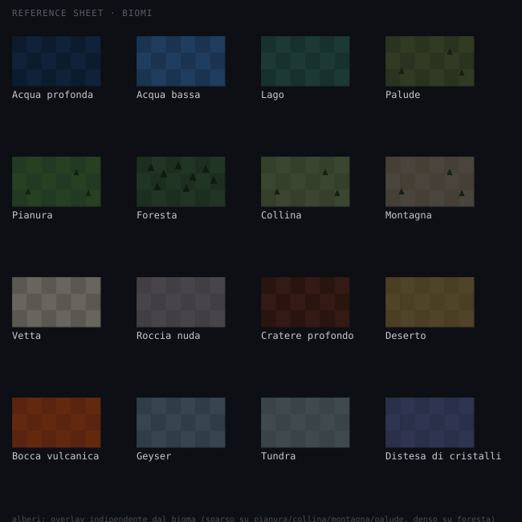

# Abiogenesis — sistema di biomi

Documento autonomo per un task di integrazione. Contiene tutti i biomi proposti, i loro valori ambientali di base, le regole per l'overlay degli alberi, e i collegamenti con le meccaniche di gioco esistenti o proposte altrove. Non richiede la lettura di altri documenti per essere capito, a parte il GDD per i riferimenti a formule/costanti citate.

## Contesto

Il gioco ha già un layer ambientale (`temperature`, `light`, `toxicity`, §5.2 GDD) e regole che legano l'ambiente alla sopravvivenza degli organismi (`env_fit`, §5.6). Oggi però questo layer è generato solo come due gradienti statici su due assi (Phase 0) o, nella build attuale, reso con un rendering troppo morbido/sfumato che ne appiattisce la leggibilità (vedi nota di stile più sotto). Il sistema di biomi qui proposto dà una **forma leggibile e diversificata** a quel layer, mantenendo tutti i vincoli già definiti (pilastro 3, quadratini colorati, nessun asset grafico).

## Stile di rendering (vincolo trasversale a tutti i biomi)

Per coerenza con l'estetica già stabilita nel resto del gioco (console/laboratorio, dati leggibili):

- **Colore piatto per cella, non gradiente.** Ogni cella appartiene a un bioma discreto e prende un colore piatto, non una sfumatura continua tra biomi.
- **Bordi netti allineati alla griglia.** I confini tra biomi sono linee sottili sul bordo condiviso tra celle, non forme vettoriali morbide o sfumate. I confini con l'acqua (linea di costa) sono più marcati dei confini interni tra biomi terrestri.
- **Dithering leggero, non blending.** Per dare consistenza materica a un bioma senza sfumare mai il confine con la cella accanto, si alternano due toni molto vicini a scacchiera (pattern fisso) all'interno dello stesso bioma — mai un gradiente continuo.
- **Overlay come tinta piatta a opacità fissa, non blend.** Quando un'informazione aggiuntiva (es. una zona calda) si sovrappone a un bioma, va resa come una tinta piatta uniforme sopra il colore base, non come una media/fusione dei due colori — altrimenti si ottengono colori "sporchi" e ambigui che non comunicano più un dato preciso.
- **Ogni colore deve rappresentare un dato reale**, non essere solo decorativo — coerente con la scelta già presa altrove di scartare biomi/regioni a colore arbitrario scollegato dalla simulazione.

## I biomi

16 biomi in totale: i 12 richiesti più 4 proposti per agganciarsi meglio alle meccaniche di gioco (motivazione di ciascuno più sotto).

| Bioma | `temperature` | `light` | `toxicity` | Alberi | Nota meccanica |
|---|---|---|---|---|---|
| Acqua profonda | 0.30 | 0.10 | 0.00 | no | nessun archetipo terrestre può occuparla oggi |
| Acqua bassa | 0.40 | 0.50 | 0.00 | no | nicchia costiera, luce moderata |
| Lago | 0.45 | 0.40 | 0.05 | no | acqua ferma, residuo si accumula → nicchia per decompositori |
| Palude | 0.50 | 0.30 | 0.45 | sparso | tossicità elevata di base — stessa logica della zona tossica già esistente, qui diffusa su un intero bioma invece che su un rettangolo isolato |
| Pianura | 0.50 | 0.60 | 0.00 | sparso | bioma di riferimento, baseline per gli altri |
| Foresta | 0.50 | 0.35 | 0.00 | denso | luce ridotta sotto la chioma (nuance meccanica: più "lussureggiante" a vista ma meno luce reale di quanto sembri), residuo alto |
| Collina | 0.45 | 0.55 | 0.00 | sparso | transizione, valori moderati ovunque |
| Montagna | 0.25 | 0.70 | 0.00 | sparso | freddo, molta luce |
| Vetta | 0.05 | 0.85 | 0.00 | no | estremo freddo, solo archetipi molto specializzati sopravvivono |
| Roccia nuda | 0.40 | 0.50 | 0.30 | no | scarsa risorsa organica → nicchia naturale per il metabolismo chemiolitotrofo del task 108 (`Cell.toxicity` → gain, GDD §5.4) — il valore va ritoccato insieme a quel task, non lasciato come stima isolata |
| Cratere profondo | 0.60 | 0.20 | 0.60 | no | depressione in ombra, tossicità residua da impatto — vedi "Collegamenti" sotto; anche questo valore va riletto insieme al task 108 |
| Deserto | 0.85 | 0.90 | 0.00 | no | luce altissima, escursione termica forte |
| Bocca vulcanica | 0.95 | 0.40 | 0.40 | no | fonte di calore puntiforme che diffonde nell'ambiente — vedi "Collegamenti" |
| Geyser | 0.80 | 0.40 | 0.10 | no | fonte di calore/umidità puntiforme e pulsante, impronta piccola (1-2 celle) — vedi "Collegamenti" |
| Tundra | 0.10 | 0.50 | 0.00 | no | estremo freddo alternativo alla vetta, ma pianeggiante (nicchia fredda più accessibile) |
| Distesa di cristalli | 0.40 | 0.60 | 0.20 | no | chimica anomala — candidato per attivare un tag genetico raro/unico, non pienamente descrivibile con i soli tre scalari ambientali esistenti (vedi "Collegamenti") |

*I valori sono un baseline di partenza, coerenti nell'ordine di grandezza con gli altri valori già presenti in §5.9 GDD — da validare in playtesting come tutto il resto del bilanciamento numerico del gioco.*

**Nota sui valori di `toxicity`:** sono un placeholder di forma, non un bilanciamento indipendente. Il task 108 (chemolithotroph, gain da `Cell.toxicity`, già scoping fatto e in coda) rende `toxicity` un input diretto di un metabolismo appena atterra — a quel punto i valori per bioma (Roccia nuda 0.30 in particolare, ma anche Cratere profondo, Palude, Distesa di cristalli) vanno ritoccati insieme a quel task, non trattati come colore a sé stante.

### Perché questi 4 biomi in più

- **Bocca vulcanica** e **Geyser** sono la versione "bioma" delle sorgenti di calore puntiformi — già implementate (task 085, vedi "Collegamenti"), non più un'idea da valutare. Sono i luoghi naturali dove le sorgenti si trovano fisicamente sulla mappa: la bocca vulcanica come sorgente forte e costante (già agganciabile oggi), il geyser come sorgente più piccola e pulsante nel tempo — quest'ultima variante non esiste ancora, vedi "Collegamenti" per il dettaglio (si aggancerebbe anche alla proposta, discussa altrove, di far "respirare" l'ambiente con micro-animazioni anche a griglia vuota).
- **Tundra** dà un estremo freddo accessibile e pianeggiante, in coppia con il deserto (estremo caldo): senza, l'unico modo per sperimentare freddo estremo sarebbe la vetta, molto più piccola e marginale come superficie disponibile.
- **Distesa di cristalli** è la proposta più speculativa: un bioma dalla tonalità visivamente "aliena" (fuori dalla palette naturale terrosa/verde degli altri), pensato come possibile innesco per un tag genetico raro o un comportamento unico — un modo per rendere *scoperta* anche la semplice esplorazione geografica della mappa, non solo la decodifica della matrice biochimica.

### Collegamenti con altre proposte di design

- **Cratere profondo come sito del "Precursore".** In un documento di design separato (proposte per rendere il gioco più coinvolgente nei primi minuti) è stata proposta una singola cella fissa per mondo con una chimica anomala costante, che agisce come polo di attrazione narrativo. Il cratere profondo è il luogo naturale per farla coincidere fisicamente: invece di due elementi scollegati sulla mappa (un'anomalia invisibile e un bioma), diventano un unico luogo con più strati di mistero da scoprire insieme.
- **Bocca vulcanica / Geyser e le sorgenti di calore puntiformi — già implementate, non una proposta parallela.** Il task 085 (`tasks/done/085-source-driven-temperature-and-light.md`) ha **già** sostituito i gradienti fissi con sorgenti di calore puntiformi: `SimWorld.heat_sources: Vec<usize>` (`world.rs:200`), piazzate da `place_heat_sources` (`world.rs:559-604`) e mantenute per-tick da `reinject_environment_sources` (`world.rs:703`). Di conseguenza:
  - **Bocca vulcanica** può agganciarsi da subito alle celle in `heat_sources` esistenti — nessuna dipendenza residua da risolvere.
  - **Geyser** resta bloccato: tutte le sorgenti del task 085 sono meccanicamente identiche (stessa intensità costante, nessun pulsare nel tempo). Non esiste ancora una seconda categoria di sorgente più piccola e variabile — serve prima quel lavoro (fuori scope qui) perché Geyser sia un bioma realmente distinto da Bocca vulcanica invece che lo stesso dato con un nome diverso, il che violerebbe il vincolo di stile "ogni colore deve rappresentare un dato reale" dichiarato più sopra in questo documento. Fino ad allora Geyser resta un bioma statico soltanto (nessuna animazione/pulsazione).
- **Roccia nuda e il metabolismo chemiolitotrofo.** Il task 108 (chemolithotroph, gain da `Cell.toxicity`, GDD §5.4) è già scoping fatto e in coda, non più una semplice estensione futura indefinita. La roccia nuda, con `toxicity 0.30` e bassa risorsa organica altrove, è la nicchia naturale per quel metabolismo — i valori di tossicità di questo bioma (e degli altri biomi tossici) vanno ritoccati insieme a quel task prima di considerarli chiusi.

## Overlay: alberi

Gli alberi **non sono un bioma**, sono un livello di decorazione indipendente sopra il bioma:

- **Densità sparsa** su: Pianura, Collina, Montagna, Palude.
- **Densità densa** su: Foresta (è la caratteristica distintiva di quel bioma).
- **Assenti** su tutti gli altri biomi (acqua in ogni sua forma, vetta, roccia nuda, cratere, deserto, bocca vulcanica, geyser, tundra, distesa di cristalli) — coerenza con le condizioni ambientali di ciascuno (troppo freddo, troppo arido, nessun suolo).

## Immagini

### Tavola di riferimento

Ogni bioma mostrato come swatch isolato: colore piatto a due toni (dithering), nome, e overlay alberi dove previsto (sparso su pianura/collina/montagna/palude, denso su foresta).

### Mappa d'esempio composta

Mostra come i biomi si comporrebbero insieme su una mappa reale: costa a ovest (acqua profonda/bassa), una catena montuosa diagonale con vette e colline di transizione, un lago interno circondato da palude, foreste in due punti separati, deserto e tundra agli angoli opposti (caldo/freddo), roccia nuda vicino ai rilievi, un cratere profondo con una bocca vulcanica al centro, un geyser ai piedi della montagna, e una piccola distesa di cristalli isolata. **La disposizione specifica è solo dimostrativa** (generata con funzioni geometriche di prova per mostrare come i biomi si affiancano in modo plausibile) — la generazione reale dipenderà dall'algoritmo di world-gen del gioco.

**Nota — discrepanza con il GDD:** il documento di design (§5.1) dichiara una griglia **48×32** come dimensione di partenza. La mappa d'esempio qui usa **128×80**, la dimensione effettivamente in uso. Vale la pena verificare se il GDD è semplicemente non aggiornato rispetto a una modifica successiva, o se le due fonti sono scollegate per un altro motivo — non è qualcosa che questo documento può risolvere da solo, ma va segnalato per evitare che altri task si basino sul valore sbagliato.

## Cosa serve per l'integrazione (per chi implementa)

- **Assegnazione del bioma — architettura a due stadi**, non una funzione unica elevazione+scalari:
  - **Stadio A (esiste già):** l'elevazione è già un campo di simulazione reale, non ipotetico — `TerrainKind` (`Sea/Plain/Hill/Mountain`, `world.rs:140-146`) e il flag sparso `is_peak` (`world.rs:165`, task 068) danno il landform di base. Questo copre già strutturalmente Acqua/Pianura/Collina/Montagna/Vetta.
  - **Stadio B (da costruire):** i tre scalari ambientali già esistenti (`temperature`, `light`, `toxicity`) rifiniscono il landform di base nel bioma finale (es. `Plain` + `toxicity` alta → Palude; `Plain` + temperatura/luce estreme → Deserto/Tundra). La tabella sopra fornisce i valori target per bioma.
  - **Biomi "feature" piazzati esplicitamente**, non dedotti dagli scalari: Cratere profondo, Distesa di cristalli, Lago, Bocca vulcanica (quest'ultima già agganciabile a `heat_sources`, vedi "Collegamenti") non emergono in modo affidabile da soglie sui tre scalari — vanno piazzati con lo stesso pattern bounded-retry già usato da `place_toxic_zone`/`place_heat_sources` (`world.rs:345-403`, `:559-604`), imponendo poi i propri valori target sulle celle occupate invece di dedurli.
- **Palude sostituisce `toxic_zone` — costo da preventivare.** Il rettangolo isolato `toxic_zone` (`config.rs` `toxic_zone_*`, piazzato da `place_toxic_zone`, `world.rs:345-403`) viene sostituito dal bioma Palude. Ma `toxic_zone` è anche letto da un obiettivo di gioco reale — `ZoneKind::Toxic` (`objectives.rs:320-336`) verifica `world.toxic_zone.contains(x, y)`, un rettangolo con bounds fissi. La sostituzione richiede riscrivere quell'obiettivo da "dentro il rettangolo" a "dentro una cella del bioma Palude" (membership, non più bounds fissi — Palude può essere multi-patch e di forma irregolare) — è parte dello scope, non un effetto collaterale silenzioso.
- **Rendering:** riusare esattamente le stesse tecniche già stabilite per la mappa a fasce di elevazione (bordi netti sul confine tra celle di bioma diverso, coste più marcate dei confini interni, dithering a due toni, overlay a tinta piatta invece di blend) — nessuna tecnica nuova, solo applicata a più categorie.
- **Overlay alberi:** livello di rendering separato dal colore del bioma, con probabilità/densità di occorrenza per cella secondo la regola sparso/denso/assente sopra.
- **Geyser come elemento animato:** a differenza degli altri biomi (statici), il geyser è pensato per pulsare nel tempo — ma questo richiede prima una sorgente di calore piccola/variabile che oggi non esiste (vedi "Collegamenti": le sorgenti del task 085 sono tutte identiche e costanti). Finché quel lavoro non esiste, Geyser resta un bioma statico come gli altri.

## Fuori scope

- Algoritmo di generazione procedurale reale dei biomi (qui solo un esempio dimostrativo, non un algoritmo di produzione).
- Una seconda categoria di sorgente puntiforme, piccola e pulsante nel tempo (necessaria perché Geyser sia distinto da Bocca vulcanica — le sorgenti del task 085 sono già implementate ma tutte identiche, vedi "Collegamenti"): la sua implementazione è materia di un altro task.
- Il metabolismo chemiolitotrofo legato alla roccia nuda: l'implementazione stessa è il task 108 (già scoping fatto, fuori scope qui); questo documento fissa solo i valori di `toxicity` di partenza da riconciliare con quel task.
- Riscrittura di `ZoneKind::Toxic` (`objectives.rs:320-336`) da rettangolo a bioma-membership, necessaria quando Palude sostituisce `toxic_zone` (vedi "Cosa serve per l'integrazione") — è un task di implementazione a sé, non deciso qui.
- Bilanciamento numerico fine dei valori ambientali per bioma — sono un baseline di partenza, da validare in playtesting.
