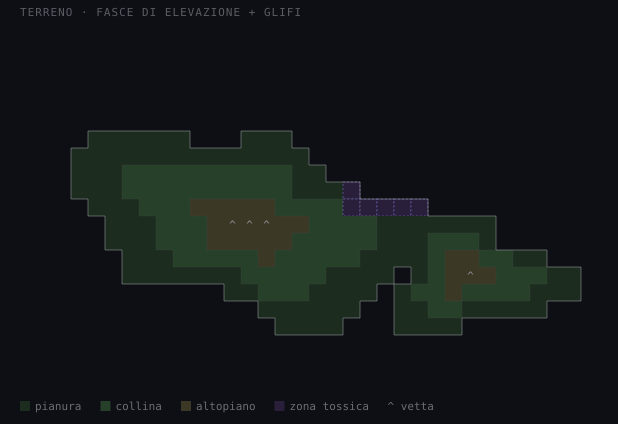

# Abiogenesis — mappa terreno a fasce di elevazione

Documento autonomo per un task di integrazione: contiene contesto, decisioni e riferimento visivo. Non richiede la lettura di altri documenti di redesign per essere capito, a parte il GDD del gioco per i dettagli di simulazione (temperatura/luce/tossicità) già esistenti.

## Contesto

La mappa di simulazione attuale mostra solo organismi (pallini colorati) su sfondo nero uniforme: l'ambiente (temperatura, luce, tossicità — dati già simulati e mostrati testualmente altrove nell'interfaccia) non ha alcuna rappresentazione visiva sulla griglia. L'obiettivo è dare una sensazione credibile di "mondo alieno" — confini, altopiani, rilievo — restando fedeli al pilastro di design "il divertimento sta nel sistema, non nella grafica": niente texture, gradienti continui o asset illustrativi, solo colore piatto e forma.

## Decisione

**Fasce di elevazione discrete + glifi radi**, non gradiente continuo e non biomi arbitrari (quest'ultima opzione — tasselli irregolari colorati senza legame con un dato reale — è stata scartata: somigliava troppo a una mappa "illustrata", perdendo il collegamento diretto tra colore e informazione di simulazione).

### Regole concrete

1. **3-4 fasce di elevazione, colore piatto per fascia.** Non gradiente: ogni cella appartiene a una fascia discreta e prende il colore piatto di quella fascia. Il "salto" tra fasce è quello che dà lettura di rilievo, non una sfumatura.
2. **Confini come linee sottili, non come riempimento.** Il confine tra due celle di fascia diversa viene disegnato come linea sottile sul bordo condiviso, non come area di transizione colorata.
   - Confine con il vuoto/non-terra (linea di costa) → linea più marcata e più chiara, per leggerla come "limite del mondo conosciuto/esplorabile".
   - Confine tra fasce interne (es. pianura/collina) → linea più sottile e più scura, presente ma secondaria.
3. **Vuoto = nero, non disegnato.** Le celle fuori dalla forma del terreno restano sfondo puro (coerente con l'interfaccia attuale), nessun "oceano" o riempimento aggiuntivo.
4. **Glifi solo su celle notevoli, non su ogni cella.** Un carattere monospace (`^`) compare solo nei punti di massima elevazione locale (vette), non su tutte le celle della fascia più alta — l'accento va usato con parsimonia, altrimenti diventa rumore visivo.
5. **Zona tossica come overlay dedicato**, non come fascia di elevazione: contorno tratteggiato viola, stesso trattamento visivo già usato per "elemento non ancora osservato / pericoloso" nel notebook e nella sidebar (coerenza cross-screen già stabilita in altri task di redesign).
6. **Il colore deve continuare a rappresentare un dato reale**, non un valore arbitrario — punto su cui è stata scartata l'alternativa a biomi liberi. Le fasce di elevazione, quando integrate, vanno derivate da un valore di altitudine/rilievo del generatore di mondo (se esiste nel modello dati) oppure, in assenza di un campo dedicato, da una combinazione sensata di dati già simulati — da decidere in fase di implementazione, ma **non** da un seed puramente estetico scollegato dalla simulazione.

## Immagine di riferimento

Continente principale con una penisola/isola secondaria di forma organica (generata qui solo a scopo dimostrativo con una funzione matematica di prova — la forma reale dipenderà dal generatore di mondo del gioco), tre fasce di elevazione (pianura/collina/altopiano) a colore piatto, linea di costa più marcata rispetto ai confini interni, vette isolate segnate con `^`, zona tossica come overlay tratteggiato viola.

## Cosa serve per l'integrazione (per chi implementa)

- **Dato sorgente per l'elevazione:** verificare se il generatore di mondo espone già un valore di altitudine/rilievo per cella. Se sì, mappare direttamente su 3-4 fasce con soglie fisse. Se no, va deciso da dove derivarlo prima di implementare — non inventare un valore scollegato dalla simulazione (vedi punto 6 sopra).
- **Rendering dei confini:** per ogni cella, confrontare la fascia con quella dei vicini (destra e sotto è sufficiente, evita doppio disegno) e tracciare una linea sul bordo condiviso solo se le fasce differiscono. Il vuoto (nessuna fascia / fuori mondo) va trattato come un caso a sé per lo stile della linea (più chiara/marcata).
- **Vette:** individuare celle di massimo locale nella fascia più alta (es. nessun vicino diretto con elevazione superiore) e marcarle col glifo — non tutte le celle della fascia più alta.
- **Zona tossica:** overlay indipendente sopra le fasce, usa il dato di tossicità già simulato (non richiede nuovo dato), stile coerente con quanto già stabilito per la stessa informazione altrove nell'interfaccia.
- **Palette colori:** riusare toni piatti coerenti con l'estetica già stabilita nel resto del gioco (console/laboratorio, desaturati) — non introdurre una palette nuova solo per il terreno.

## Fuori scope

- Generazione procedurale del terreno stesso (qui è solo un mockup dimostrativo, non un algoritmo da portare in produzione).
- Rappresentazione di acqua/oceano nel vuoto — resta nero come nell'interfaccia attuale, salvo decisione esplicita contraria.
- Qualsiasi texture, gradiente continuo o asset illustrativo.
